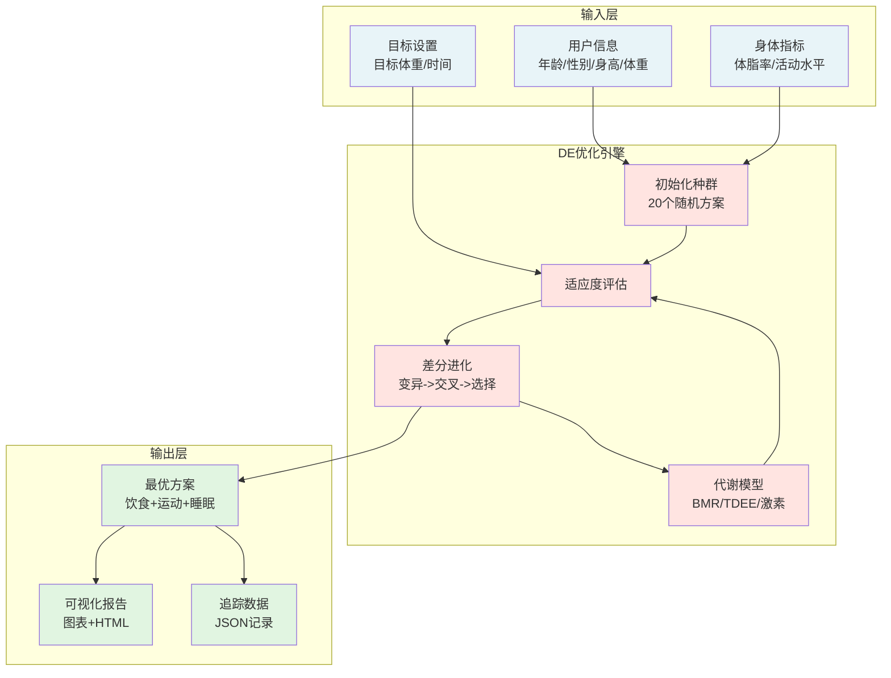
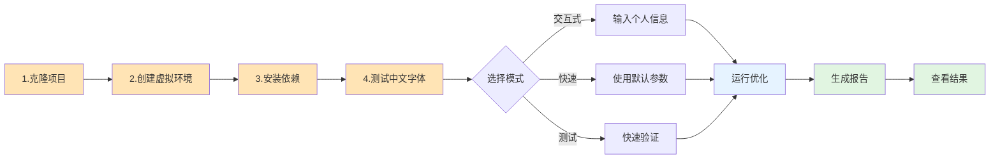
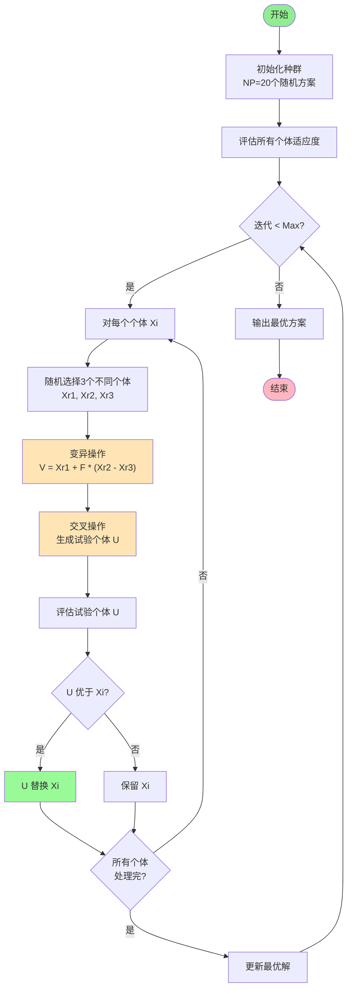
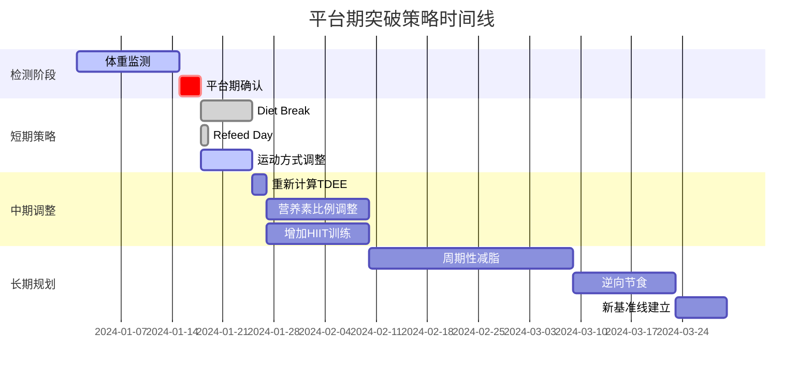
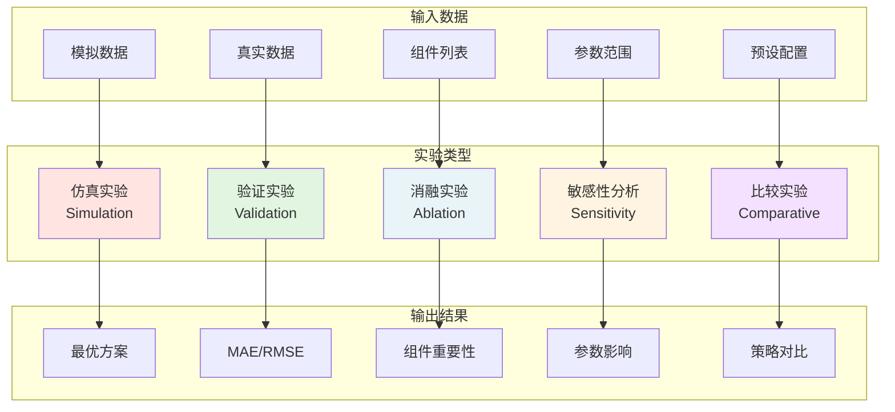

# 🏃‍♂️ 差分进化算法减肥优化系统

[](https://www.python.org/) [](https://opensource.org/licenses/MIT) [](https://github.com/) [](#)

## 📖 项目简介


​    



 *系统架构与工作流程概览图*

### 🎯 项目背景与动机

现代社会中，肥胖已成为全球性健康问题。传统的"一刀切"减肥方案往往忽视了个体差异，导致效果不佳或难以坚持。主要挑战包括：

- **个体差异性**：每个人的代谢率、生活习惯、运动能力都不相同
- **多目标冲突**：快速减脂、肌肉保护、方案可持续性往往相互矛盾
- **代谢适应**：长期限制热量会导致代谢率下降，形成平台期
- **复杂约束**：需要同时考虑营养平衡、时间限制、身体承受能力等多重约束

本系统通过引入**差分进化算法（Differential Evolution, DE）**这一强大的全局优化工具，将减肥问题转化为多目标优化问题，为每个用户量身定制最优方案。

### 🔬 科学基础

系统基于以下科学原理：

| 原理               | 应用                         | 意义             |
| ------------------ | ---------------------------- | ---------------- |
| **能量平衡方程**   | 热量缺口 = TDEE - 摄入热量   | 减重的根本驱动力 |
| **宏量营养素分配** | 蛋白质保护肌肉，碳水提供能量 | 优化身体成分变化 |
| **代谢适应理论**   | 模拟长期节食的代谢下降       | 预测和突破平台期 |
| **运动生理学**     | 有氧燃脂，力量保肌           | 最大化减脂效果   |
| **睡眠与恢复**     | 影响激素分泌和代谢           | 提高方案可持续性 |

### 🎨 系统特色

#### 1. **智能化程度高**

- 自动探索数万种可能的方案组合
- 根据反馈动态调整优化策略
- 识别并提供平台期突破建议

#### 2. **科学性强**

- 基于经过验证的生理学模型
- 考虑激素（瘦素、皮质醇、甲状腺激素）影响
- 模拟NEAT（非运动性活动消耗）变化

#### 3. **个性化精准**

- 根据用户的年龄、性别、体成分定制
- 考虑活动水平和生活方式
- 适应不同的减重阶段

#### 4. **可视化丰富**

- 10+ 种专业图表
- 交互式HTML报告
- 动画展示减重过程

## 🚀 快速开始



*从安装到查看结果的完整流程图*

### 系统要求

#### 硬件要求

- **内存**：建议 4GB 以上（大规模实验需要 8GB+）
- **处理器**：支持多核处理器以提高运算速度
- **存储**：至少 500MB 可用空间

#### 软件要求

- **Python**：3.8 或更高版本

- 操作系统

  ：

  - Windows 10/11
  - macOS 10.14+
  - Linux (Ubuntu 18.04+, CentOS 7+)

### 详细安装指南

#### 1. 环境准备

```bash
# 克隆项目
git clone https://github.com/yourusername/de-weight-loss-optimizer.git
cd de-weight-loss-optimizer

# 创建虚拟环境（强烈推荐）
python -m venv venv

# 激活虚拟环境
# Windows PowerShell
.\venv\Scripts\Activate.ps1
# Windows CMD
.\venv\Scripts\activate.bat
# macOS/Linux
source venv/bin/activate
```

#### 2. 依赖安装

```bash
# 升级pip
pip install --upgrade pip

# 安装核心依赖
pip install numpy pandas matplotlib seaborn

# 安装科学计算库
pip install scipy scikit-learn

# 安装所有依赖（推荐）
pip install -r requirements.txt
```

#### 3. 字体配置（中文支持）

```bash
# 测试中文显示
python test_font.py

# 如果显示异常，请根据系统安装中文字体：
# Windows: 系统自带微软雅黑
# macOS: 安装 PingFang SC
# Linux: sudo apt-get install fonts-wqy-microhei
```

### 🎮 使用指南

#### 场景一：初次使用者

 

*交互式模式的输入界面示例*

如果您是第一次使用本系统，建议采用交互式模式：

```bash
python main.py --mode interactive
```

系统会引导您输入：

1. **基本信息**：年龄、性别、身高、体重
2. **身体指标**：体脂率（可选，系统可估算）
3. **活动水平**：从久坐到极度活动的5个级别
4. **减肥经历**：已经减肥的周数（影响代谢适应）

#### 场景二：快速体验

想要快速看到效果？使用预设配置：

```bash
# 平衡模式 - 适合大多数人
python main.py --mode default --preset balanced --output ./my_results

# 查看更多选项
python main.py --help
```

#### 场景三：批量实验

研究人员可以运行批量实验：

```python
# experiment_batch.py
from experiment_runner import ExperimentRunner
from metabolic_model import PersonProfile

# 创建多个测试对象
test_subjects = [
    PersonProfile(age=25, gender='male', height=175, weight=85, ...),
    PersonProfile(age=35, gender='female', height=165, weight=75, ...),
    # ... 更多测试对象
]

runner = ExperimentRunner()
for i, subject in enumerate(test_subjects):
    runner.run_simulation_experiment(subject, f"subject_{i:03d}")
```

## 📊 核心概念详解

### 差分进化算法工作原理



*差分进化算法的核心步骤：变异、交叉、选择*

差分进化是一种基于种群的随机搜索算法，特别适合解决复杂的非线性优化问题。在本系统中的应用流程：

```
1. 初始化阶段
   ├─ 生成20个随机方案（种群）
   ├─ 每个方案包含8个决策变量
   └─ 确保满足所有约束条件

2. 进化迭代（每周）
   ├─ 评估当前种群的适应度
   ├─ 对每个个体执行：
   │   ├─ 变异：借鉴其他方案的优点
   │   ├─ 交叉：产生新的试验方案
   │   └─ 选择：保留更优的方案
   └─ 更新最优解

3. 终止条件
   ├─ 达到最大迭代次数（默认12周）
   ├─ 连续3周无明显改善（早停）
   └─ 达到目标体重
```

### 适应度评估体系

 

*三维目标的权重分配和评估流程*

系统采用多目标加权的方式评估方案优劣：

| 评估维度     | 权重 | 评估标准             | 理想值   |
| ------------ | ---- | -------------------- | -------- |
| **肌肉保护** | 40%  | 肌肉流失占总减重比例 | <10%     |
| **脂肪减少** | 40%  | 每周脂肪减少量       | 0.5-1kg  |
| **可持续性** | 20%  | 执行难度和依从性     | 综合评分 |

#### 可持续性评分细则

- **热量限制程度**（30%）：过度限制难以长期坚持
- **运动强度**（25%）：过量运动导致疲劳和受伤风险
- **睡眠质量**（20%）：影响恢复和意志力
- **饮食灵活性**（15%）：极端饮食方案难以执行
- **时间因素**（10%）：长期执行同一方案会降低依从性

### 代谢适应机制

 

*长期减肥过程中的代谢适应现象和激素变化*

长期减肥会触发身体的"生存模式"，导致：

1. **基础代谢率下降**：最多可降低25%

2. **NEAT减少**：日常活动消耗降低

3. 激素变化

   ：

   - 瘦素↓ → 饥饿感↑
   - 皮质醇↑ → 肌肉分解↑
   - 甲状腺激素↓ → 代谢率↓

系统通过以下策略应对：

- **热量循环**：周期性提高热量摄入
- **碳水循环**：高低碳水交替
- **训练变化**：改变运动类型和强度

## 📈 结果解读指南

### 理解您的优化报告

运行完成后，打开 `weight_loss_report.html`，您将看到：

 

*HTML报告界面示例，展示关键指标和图表*

#### 1. 关键成果卡片

- **总减重**：整个周期的体重变化
- **周均减重**：评估减重速度是否健康（理想值0.5-1kg）
- **体脂变化**：真正的减脂效果
- **肌肉变化**：理想情况应该是微量减少或增加

#### 2. 最优方案详情

系统推荐的方案包含具体数值，但请理解这些是**指导值**而非绝对值：

- **热量摄入**：可在±100kcal范围内调整
- **营养比例**：可根据个人偏好微调±5%
- **运动安排**：根据实际情况灵活调整时间
- **睡眠时长**：这是建议值，质量比时长更重要

#### 3. 趋势图表解读

 

*各类图表的含义和解读方法*

**体重变化曲线**：

- 平滑下降：理想状态
- 阶梯状：正常，反映水分波动
- 平台期标记：黄色区域，需要策略调整

**体成分分析**：

- 肌肉线（绿色）：应该保持平稳或微降
- 脂肪线（红色）：应该持续下降
- 体脂率线（橙色）：最重要的指标

**代谢适应追踪**：

- 0到-10%：轻度适应，正常范围
- -10%到-20%：中度适应，考虑干预
- 超过-20%：重度适应，需要恢复期

### 如何应对平台期



*平台期识别和突破策略的时间线*

当系统检测到平台期时，会自动生成突破建议：

1. **短期策略**（1-2周）
   - Diet Break：恢复到维持热量
   - Refeed Day：高碳水日
   - 改变运动方式
2. **中期调整**（2-4周）
   - 重新计算TDEE
   - 调整宏量营养素比例
   - 增加HIIT训练
3. **长期规划**
   - 周期性减脂和维持
   - 逆向节食恢复代谢
   - 建立新的基准线

## 🔬 高级功能详解

### 实验框架使用



*五种实验模式的对比和应用场景*

本系统提供完整的实验框架，支持科学研究和方案验证：

#### 1. 仿真实验

测试算法在不同条件下的表现：

```python
runner.run_simulation_experiment(person, "sim_001")
```

**用途**：算法开发、参数调优、理论研究

#### 2. 验证实验

使用真实数据验证模型准确性：

```python
runner.run_validation_experiment("real_data.csv", "val_001")
```

**用途**：模型验证、精度评估、算法改进

#### 3. 消融实验

评估各组件的重要性：

```python
runner.run_ablation_study(person, 
    ['metabolic_adaptation', 'sleep', 'strength_training'], 
    "ablation_001")
```

**用途**：识别关键因素、简化模型、学术研究

#### 4. 敏感性分析

测试参数变化的影响：

```python
runner.run_parameter_sensitivity_analysis(person, 
    {'population_size': [5, 10, 20, 30]}, 
    "sensitivity_001")
```

**用途**：参数选择、稳定性分析、优化配置

#### 5. 比较实验

对比不同策略的效果：

```python
runner.run_comparative_experiment(person, 
    ['aggressive', 'balanced', 'conservative'], 
    "comparison_001")
```

**用途**：策略选择、个性化推荐、效果对比

### 自定义扩展

#### 添加新的适应度评估标准

```python
# 在 fitness_evaluator.py 中扩展
class CustomFitnessEvaluator(FitnessEvaluator):
    def calculate_custom_score(self, solution, person):
        # 您的自定义评分逻辑
        return score
    
    def calculate_fitness(self, simulation_results, solution, person):
        base_fitness = super().calculate_fitness(simulation_results, solution, person)
        custom_score = self.calculate_custom_score(solution, person)
        return base_fitness * 0.8 + custom_score * 0.2
```

#### 集成新的代谢模型

```python
# 在 metabolic_model.py 中扩展
class CustomMetabolicModel(MetabolicModel):
    def calculate_bmr(self, person):
        # 使用不同的BMR计算公式
        # 例如：Katch-McArdle 公式（基于瘦体重）
        return 370 + (21.6 * person.lean_body_mass)
```

## 📊 数据管理

### 输入数据准备

#### CSV格式要求

```csv
week,weight,body_fat_percentage,muscle_mass,calories_consumed,cardio_minutes,strength_minutes,sleep_hours
0,85.0,25.0,45.0,2000,0,0,7.5
1,84.5,24.8,44.9,1900,150,120,7.5
2,84.1,24.5,44.8,1900,150,120,8.0
```

#### 必需字段

- `week`：时间序列
- `weight`：体重（kg）
- `body_fat_percentage`：体脂率（%）

#### 可选字段

- `muscle_mass`：肌肉量（kg）
- `calories_consumed`：摄入热量
- 各类运动和生活数据

### 输出数据结构

系统生成的 `tracking_data.json` 包含完整的优化历史：

```json
{
  "data": {
    "week": [...],
    "weight": [...],
    "body_fat_percentage": [...],
    "solution": [
      [calories, protein_ratio, carb_ratio, ...],
      ...
    ],
    "fitness_score": [...],
    "metabolic_adaptation_factor": [...]
  },
  "metadata": {
    "person_profile": {...},
    "optimization_config": {...},
    "total_iterations": 12,
    "convergence_achieved": true
  }
}
```

### 数据备份与恢复

```bash
# 备份结果
cp -r ./results ./results_backup_$(date +%Y%m%d)

# 从JSON恢复数据进行分析
python -c "
from visualization import DataTracker
tracker = DataTracker()
tracker.load_from_file('tracking_data.json')
# 继续分析...
"
```

## ⚡ 性能优化

### 运行速度优化

1. **减少种群规模**（轻度影响精度）

   ```python
   config.algorithm.population_size = 10  # 默认20
   ```

2. **启用早停机制**（推荐）

   ```python
   config.algorithm.early_stopping = True
   config.algorithm.patience = 3
   ```

3. **并行计算**（实验性功能）

   ```python
   config.system.parallel_evaluation = True
   config.system.num_threads = 4
   ```

### 内存使用优化

- **限制历史记录**：仅保存最近N代的种群
- **简化可视化**：生成基础图表而非完整仪表板
- **分批处理**：对大规模实验分批运行

### 精度与速度权衡

 

*不同配置下的运行时间和精度对比*

| 配置 | 种群规模 | 迭代次数 | 运行时间 | 精度 |
| ---- | -------- | -------- | -------- | ---- |
| 快速 | 5        | 5        | ~30秒    | 较低 |
| 平衡 | 10       | 12       | ~2分钟   | 中等 |
| 精确 | 20       | 20       | ~5分钟   | 高   |
| 研究 | 30       | 50       | ~15分钟  | 最高 |

## 🚧 已知限制与约束

### 系统限制

1. **个体数量**：单次优化最多支持100个种群
2. **时间跨度**：建议不超过24周（6个月）
3. **并发用户**：单机版本，不支持多用户并发

### 模型假设

1. **线性能量平衡**：1kg脂肪 ≈ 7700 kcal（简化）
2. **固定活动系数**：未考虑季节和环境变化
3. **理想依从性**：假设100%执行推荐方案

### 适用范围

✅ **适用于**：

- BMI 19-40 的成年人
- 一般健康状况良好
- 有基础运动能力
- 减重目标在体重的5-30%

❌ **不适用于**：

- 未成年人（<18岁）
- 孕期和哺乳期女性（特殊版本开发中）
- 严重疾病患者
- 专业运动员（需要更专业的方案）

## 🔍 常见问题解答（FAQ）

### 基础问题

**Q: 系统推荐的方案一定是最好的吗？** A: 系统提供的是在其模型和约束条件下的数学最优解。实际执行时，您应该：

- 将其作为参考起点
- 根据身体反应调整
- 保持与医生或营养师的沟通

**Q: 为什么我的结果和朋友的差异很大？** A: 系统考虑了多个个体因素：

- 基础代谢率差异（年龄、性别、体成分）
- 活动水平和运动能力
- 减肥历史（代谢适应）
- 初始体脂率

**Q: 平台期是正常的吗？** A: 完全正常！平台期是身体的保护机制。系统会：

- 检测平台期（连续2周体重变化<0.2kg）
- 提供突破策略
- 调整方案防止代谢过度适应

### 技术问题

**Q: 运行时间过长怎么办？** A: 尝试以下方法：

1. 使用测试模式快速验证：`--mode test`
2. 减少迭代次数：`config.algorithm.max_iterations = 8`
3. 使用更激进的早停：`config.algorithm.patience = 2`

**Q: 中文显示乱码？** A: 这是字体问题，解决方案：

```bash
# 1. 运行字体测试
python test_font.py

# 2. 清理matplotlib缓存
rm -rf ~/.matplotlib/fontlist-*.json

# 3. 重新运行程序
```

**Q: 如何比较不同时期的结果？** A: 系统会自动保存所有运行记录：

```python
# 加载多个时期的数据
from visualization import DataTracker, WeightLossVisualizer

tracker1 = DataTracker()
tracker1.load_from_file('results/20240101/tracking_data.json')

tracker2 = DataTracker()
tracker2.load_from_file('results/20240201/tracking_data.json')

# 创建对比报告
viz = WeightLossVisualizer()
viz.create_comparison_report({
    '一月方案': tracker1,
    '二月方案': tracker2
})
```

### 结果解释

**Q: 适应度值是什么意思？** A: 适应度值是方案优劣的综合评分（越低越好）：

- < 0.3：优秀方案

- 0.3-0.5：良好方案

- 0.5-0.7：一般方案

- > 0.7：需要改进

**Q: 为什么肌肉也会减少？** A: 减重过程中少量肌肉流失是正常的，系统会尽量最小化：

- 确保充足蛋白质（1.6-2.2g/kg）
- 保持力量训练
- 避免过度的热量赤字

## 🏆 最佳实践建议

### 使用建议

1. **循序渐进**
   - 先用平衡模式（balanced）建立基础
   - 适应后可尝试激进模式（aggressive）
   - 接近目标时切换到保守模式（conservative）
2. **定期评估**
   - 每2周运行一次优化，更新身体数据
   - 对比历史结果，观察趋势
   - 根据实际情况调整配置
3. **综合考虑**
   - 不要只关注体重，体脂率更重要
   - 注意身体信号（疲劳、情绪、睡眠）
   - 保持生活质量和社交活动

### 安全建议

⚠️ **重要提醒**：

1. **医疗咨询**：开始前咨询医生，特别是有基础疾病者
2. **渐进原则**：不要突然大幅改变饮食和运动
3. **身体信号**：出现头晕、极度疲劳等立即停止
4. **定期体检**：每月检查基础健康指标
5. **心理健康**：保持积极心态，避免过度焦虑

### 长期维持

减重成功后的维持策略：

1. **逆向节食**：缓慢增加热量到新的维持水平
2. **习惯养成**：将健康行为内化为生活方式
3. **定期监测**：每周称重，及时调整
4. **灵活平衡**：允许偶尔的放松，但要有计划

## 🛠️ 故障排除指南

### 常见错误及解决方案

| 错误信息                       | 可能原因         | 解决方案                                    |
| ------------------------------ | ---------------- | ------------------------------------------- |
| `ModuleNotFoundError`          | 缺少依赖包       | `pip install -r requirements.txt`           |
| `ValueError: invalid literal`  | 输入数据格式错误 | 检查CSV格式，确保数值列不含文本             |
| `MemoryError`                  | 内存不足         | 减小种群规模或使用测试模式                  |
| `MatplotlibDeprecationWarning` | 版本兼容问题     | 更新matplotlib: `pip install -U matplotlib` |
| `FileNotFoundError`            | 路径错误         | 使用绝对路径或检查文件是否存在              |

### 调试模式

启用详细日志以排查问题：

```bash
# 开启DEBUG级别日志
python main.py --log-level DEBUG

# 查看详细错误堆栈
python main.py --mode test --log-level DEBUG 2>&1 | tee debug.log
```

### 性能分析

```python
# 使用cProfile分析性能瓶颈
python -m cProfile -o profile.stats main.py --mode test
python -c "import pstats; p = pstats.Stats('profile.stats'); p.sort_stats('time').print_stats(10)"
```

## 📚 理论背景与参考文献

### 核心算法文献

1. **Storn, R., & Price, K. (1997)**. "Differential evolution–a simple and efficient heuristic for global optimization over continuous spaces." *Journal of Global Optimization*, 11(4), 341-359.
2. **Das, S., & Suganthan, P. N. (2011)**. "Differential evolution: A survey of the state-of-the-art." *IEEE Transactions on Evolutionary Computation*, 15(1), 4-31.

### 代谢模型研究

1. **Hall, K. D., et al. (2011)**. "Quantification of the effect of energy imbalance on bodyweight." *The Lancet*, 378(9793), 826-837.
2. **Mifflin, M. D., et al. (1990)**. "A new predictive equation for resting energy expenditure in healthy individuals." *The American Journal of Clinical Nutrition*, 51(2), 241-247.
3. **Rosenbaum, M., & Leibel, R. L. (2010)**. "Adaptive thermogenesis in humans." *International Journal of Obesity*, 34(S1), S47-S55.

### 运动与营养科学

1. **Phillips, S. M., & Van Loon, L. J. (2011)**. "Dietary protein for athletes: from requirements to optimum adaptation." *Journal of Sports Sciences*, 29(S1), S29-S38.
2. **Tremblay, A., et al. (1991)**. "Impact of exercise intensity on body fatness and skeletal muscle metabolism." *Metabolism*, 43(7), 814-818.

## 🤝 贡献指南

### 如何贡献

我们欢迎各种形式的贡献：

#### 代码贡献

1. Fork 项目到您的GitHub账户
2. 创建特性分支：`git checkout -b feature/YourFeature`
3. 编写代码并添加测试
4. 提交更改：`git commit -m 'Add YourFeature'`
5. 推送分支：`git push origin feature/YourFeature`
6. 创建Pull Request

#### 问题报告

使用GitHub Issues报告问题，请包含：

- 系统信息（OS、Python版本）
- 完整的错误信息
- 复现步骤
- 期望行为

#### 功能建议

欢迎在Issues中提出新功能建议，请说明：

- 功能描述
- 使用场景
- 可能的实现方案

### 开发规范

- **代码风格**：遵循PEP 8
- **注释规范**：关键函数需要docstring
- **测试要求**：新功能需要单元测试
- **提交信息**：清晰描述更改内容

## 📄 版权与许可

### MIT许可证

Copyright (c) 2025 Meng Zhou

Permission is hereby granted, free of charge, to any person obtaining a copy of this software and associated documentation files (the "Software"), to deal in the Software without restriction, including without limitation the rights to use, copy, modify, merge, publish, distribute, sublicense, and/or sell copies of the Software, and to permit persons to whom the Software is furnished to do so, subject to the following conditions:

The above copyright notice and this permission notice shall be included in all copies or substantial portions of the Software.

### 免责声明

**医疗免责声明**： 本软件不能替代专业医疗建议、诊断或治疗。在开始任何减肥计划之前，请咨询合格的医疗保健提供者。作者不对因使用本软件而产生的任何健康问题承担责任。

**准确性声明**： 虽然我们努力确保信息的准确性，但人体生理学极其复杂，个体差异巨大。实际结果可能与预测存在差异。

**使用风险**： 用户承担使用本软件的所有风险。在任何情况下，作者均不对任何直接、间接、偶然、特殊、惩罚性或后果性损害承担责任。

### 联系方式

- 📧 Email: [202329013046n@cuc.edu.cn]
- 🐱 GitHub: [https://github.com/zhoumeng-creater/]

------

## 💪 结语

减肥不仅是体重数字的改变，更是生活方式的重塑。本系统旨在用科学的方法，帮助您找到最适合自己的健康之路。

记住：**最好的减肥方案是您能够长期坚持的方案。**

祝您：

- 🎯 达成目标
- 💪 保持健康
- 😊 享受过程
- 🌟 成为更好的自己

**健康第一，科学减重，持之以恒，必有所成！**

------

*最后更新：2025年8月*
 *版本：2.0.0*
 *状态：活跃维护中*

